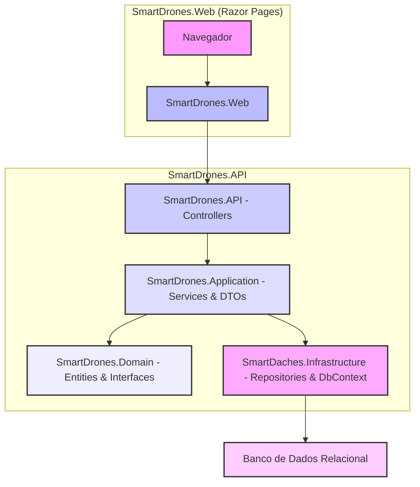
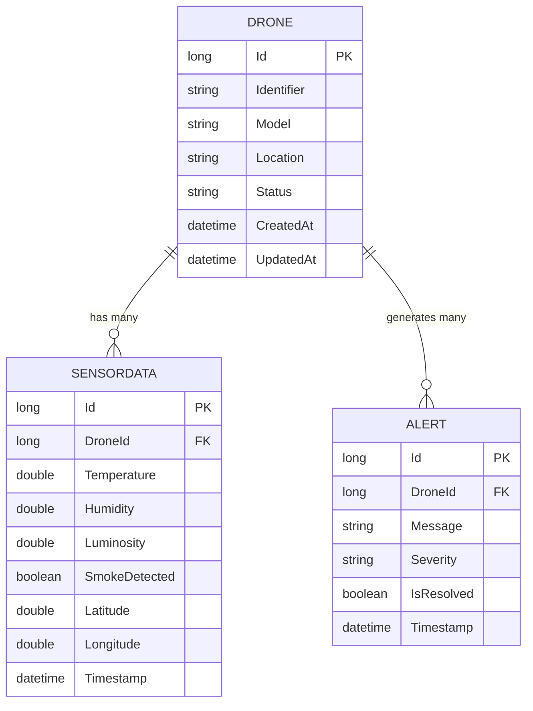

# Projeto SmartDrones: Monitoramento Inteligente e Alertas em Tempo Real

- Visão Geral:

O SmartDrones é uma solução desenvolvida para monitorar drones em tempo real, coletando dados de sensores e gerando alertas críticos para situações de urgência. Este sistema atua em cenários que exigem resposta rápida, como detecção precoce de incêndios florestais, monitoramento ambiental ou fiscalização de segurança em grandes instalações.

- Arquitetura da Solução:

A solução é construída com arquitetura em camadas, seguindo Clean Architecture e separação de responsabilidades. Garante modularidade, testabilidade e fácil manutenção.

- Diagrama de Arquitetura:

        SmartDrones.Web: Aplicação web desenvolvida com Razor Pages, responsável pela interface com interação na API.
        SmartDrones.API: Projeto de API RESTful que expõe os endpoints para gerenciamento de Drones, SensorData e Alerts.
        SmartDrones.Application: Contém a lógica de negócio e os DTOs para transmitir entre as camadas. Define interfaces para a camada de domínio.
        SmartDrones.Domain: Define as entidades (Drone, SensorData, Alert) e as interfaces dos repositórios.
        SmartDrones.Infrastructure: Implementa as interfaces de repositório, gerenciando a persistência de dados com Entity Framework Core e SmartDronesDbContext.
        Banco de Dados Relacional: O armazenamento dos dados da aplicação em Oracle Database (configurável via connection string).

- Diagrama de Entidade-Relacionamento:

        DRONE: Representa um drone, com um identificador único, modelo, localização e status.
        SENSORDATA: Contém os dados coletados pelos sensores de um drone, como temperatura, umidade, luminosidade, detecção de fumaça, coordenadas geográficas e horário da coleta.
        ALERT: Registra alertas gerados por um drone, incluindo mensagem, severidade, status de resolução e horário de emissão de alerta.

- Desenvolvimento:

Este projeto foi desenvolvido utilizando C# e framework .NET 8. As principais tecnologias e bibliotecas são:

    - ASP.NET Core: Para a construção da API REST e Razor Pages;
    - Entity Framework Core: ORM para persistência de dados em banco de dados relacional, facilitando a interação com o banco via objetos C#;
    - AutoMapper: Utilizado para simplificar o mapeamento entre entidades de domínio e DTOs, reduzindo código boilerplate;
    - Swagger/OpenAPI: Documentação interativa da API, permitindo testar os endpoints diretamente do navegador;
    - Injeção de Dependência: Utilizada para gerenciar as dependências entre as camadas e classes, promovendo inversão de controle;
    - Migrações EF Core: Para gerenciar e aplicar alterações no schema do banco de dados de forma controlada.

O desenvolvimento teve foco na implementação das operações CRUD (Create, Read, Update, Delete) para cada uma das entidades, garantindo que a API fornecesse todas as funcionalidades necessárias para a resolução do problema. Desafios como a configuração de CORS e a resolução de erros de conexão e integração de API com front-end foram superados para garantir a comunicação correta entre os projetos.

- Informações de Teste:

O projeto foi testado manualmente para garantir o funcionamento correto de cada funcionalidade:

    - Testes de API: Os endpoints da API foram testados utilizando o Swagger UI e Postman, verificando os códigos de status HTTP (200 OK, 201 Created, 400 Bad Request, 404 Not Found) e a integridade dos dados retornados e persistidos;

    - Testes da Aplicação Web: A interface do usuário foi testada navegando pelas páginas, preenchendo formulários de criação/edição, e verificando a listagem e exclusão de itens. A comunicação com a API foi validada através da observação dos dados exibidos e das respostas no console do navegador comparadas com o banco;

    - Validação de Dados: Testes foram realizados para garantir que as validações de dados estivessem funcionando tanto na API quanto no frontend.

- Instruções de Acesso e Configuração:

Siga os passos abaixo para configurar e executar o projeto em sua máquina local:

Pré-requisitos:

    .NET 8 SDK
    Um editor de código (utilizei Visual Studio Code)

Passos para Configuração

    Clonar o Repositório:
        Abra seu terminal ou prompt de comando e clone o repositório para o seu ambiente local:

        git clone https://github.com/CaiocrNyimi/SmartDronesCS.git
        cd SmartDronesCS/SmartDrones.API 

    Restaurar Dependências:
        Navegue até o diretório raiz da solução (onde o arquivo SmartDrones.sln está localizado) e restaure os pacotes NuGet:

        dotnet restore

    Configurar Connection String:

        Abra o arquivo SmartDrones.API/SmartDrones.API/appsettings.json.
        Localize a seção "ConnectionStrings" e atualize a "DefaultConnection" com a sua string de conexão para um banco de dados relacional (Já está configurado).

        Certifique-se de que o provedor do Entity Framework Core correspondente está instalado (ex: Microsoft.EntityFrameworkCore.SqlServer para SQL Server).

    Aplicar Migrações do Banco de Dados:
        
        Navegue até o diretório do projeto da API:

            cd SmartDrones.API/SmartDrones.API

        E execute as migrações para criar ou atualizar o banco de dados:

            dotnet ef database update

    (Se você precisar criar uma nova migração): dotnet ef migrations add [nomeMigration] (substitua [nomeMigration] pelo nome da sua migração).

    Confiar no Certificado HTTPS de Desenvolvimento (para evitar erros SSL):
        Abra um terminal como administrador e execute:

            dotnet dev-certs https --trust

    Configurar URL da API no Projeto Web:

        Abra SmartDrones.API/SmartDrones.Web/appsettings.json e SmartDrones.API/SmartDrones.Web/appsettings.Development.json.

        Verifique a seção "ApiSettings" e certifique-se de que "BaseUrl" aponta para a URL em que sua API será executada (http://localhost:5000).

        (A API por padrão pode usar a porta 5000. Verifique o output do dotnet run da API para a URL correta.)

Como Executar a Solução

    Iniciar a API:
        Abra um terminal novo e navegue até a pasta do projeto da API:

        cd SmartDrones.API/SmartDrones.API
        dotnet run

    Aguarde até que a API esteja rodando e exiba a URL (ex: http://localhost:5000).

    Iniciar a Aplicação Web:
        Abra um segundo terminal novo e navegue até a pasta do projeto Web:

            cd SmartDrones.API/SmartDrones.Web
            dotnet run

    Aguarde até que a aplicação Web esteja rodando e exiba as URLs (ex: http://localhost:7232).

    Acessar no Navegador:
    Copie a URL da aplicação Web (ex: https://localhost:7232) do segundo terminal e cole-a no seu navegador.

- Exemplos de Teste:

Testando a API via Swagger UI

Com a API rodando, abra seu navegador e navegue para a URL da API seguida por /swagger. Por exemplo:

    http://localhost:5000/swagger

No Swagger UI, você poderá ver todos os endpoints disponíveis (/api/Drones, /api/SensorData, /api/Alerts) e testá-los:

    GET /api/Drones: Clique em "Try it out" e depois em "Execute" para listar todos os drones.
    POST /api/Drones: Clique em "Try it out", edite o JSON do "Request body" (remova o campo id e outros campos gerados automaticamente como createdAt, updatedAt se presentes) e clique em "Execute" para criar um novo drone.
        Exemplo de Request Body para POST /api/Drones:
        JSON

        {
          "identifier": "DRONE-X-789",
          "model": "Mavic Air 2",
          "status": "Active"
        }

    GET /api/Drones/{id}: Use um ID de um drone existente e clique em "Execute" para buscar um drone específico.
    PUT /api/Drones/{id}: Edite um drone existente.
    DELETE /api/Drones/{id}: Exclua um drone.

    O mesmo processo se repete para os endpoints de SensorData e Alerts, mudando apenas os valores a serem declarados.

- Testando a Aplicação Web:

Com a aplicação Web rodando, navegue até a URL da sua aplicação.

    Navegação: Clique nos links de navegação para "Drones", "Sensor Data" e "Alerts".
    Criação:
        Na página de Drones, preencha o formulário e clique em "Create". Verifique se o novo drone aparece na lista.
        Faça o mesmo para Sensor Data e Alerts.
    Edição:
        Para um item existente, clique em "Edit", altere alguns campos e salve. Verifique se as alterações são refletidas na lista.
    Exclusão:
        Para um item existente, clique em "Delete" e confirme a exclusão. Verifique se o item desaparece da lista.
